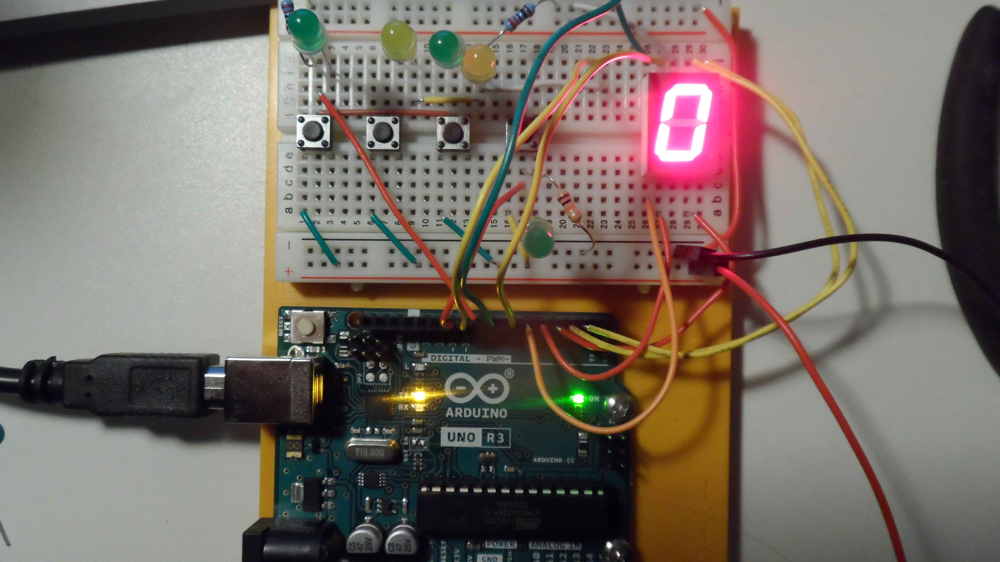

# Read-more-values-than-ports-Arduino
Using the digital pins on an arduino to read numbers given from a number of buttons in a binary configuration

This project is meant for me to simply learn and experience working with different circuits and it's components. 
The coding is very easy and only meant to show that everything is working.

Pushing the upmost button results in a 1 being the value of the variable btnVal.
Going down the column the value is incremented by 1 each time.

With this setup it can support a total of 7 buttons which aren't included here.

---

Future goal is to hook up a 7-segment display to show the corresponding value of each button press.

---
# 7-segment display
As stated above the next challange i set was implementing a display. 
The first solution i tried was to direclty wire the buttons to the display, although this was not thought through nor a good plan.
Instead a karnaugh map was made by hand for 3 binary inputs to display the correct segments as shown below.

The logic that results from the mapping is then run as an output through the arduino to each segment as shown in both the video and picture below.

[Youtube video of buttons being pressed](https://youtu.be/63bH2zisMfI)

---

Future goal is to either add more displays or something else entirely. 
